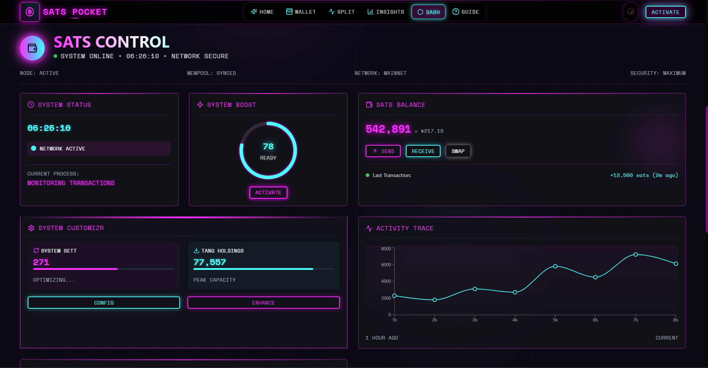
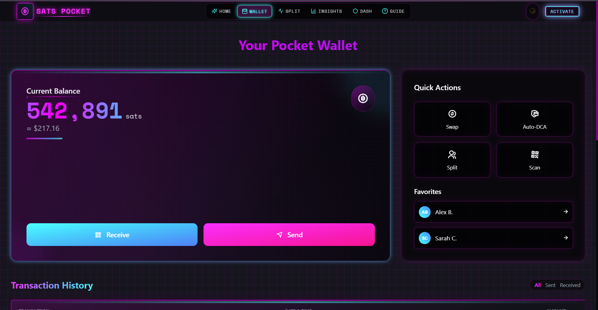
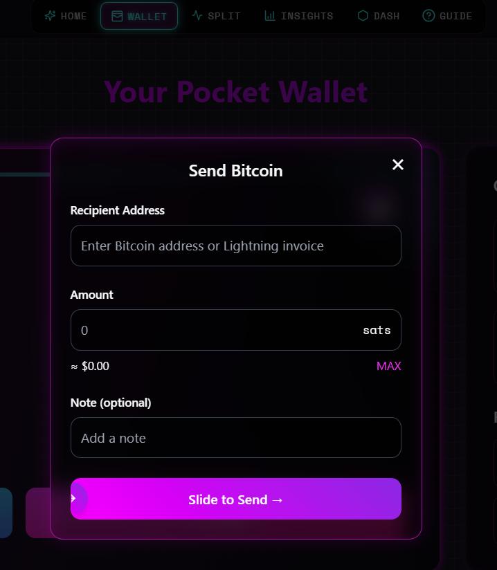
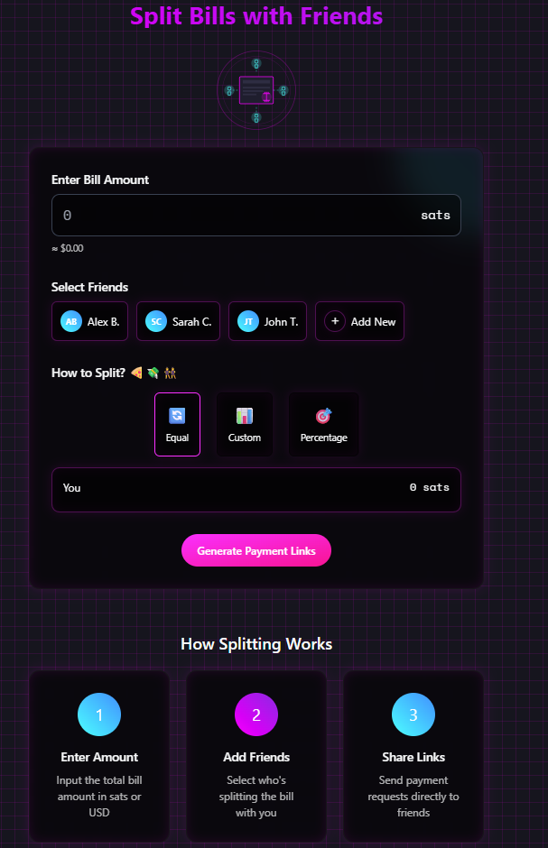

# ⚡ Sats Pocket

> **Sats Pocket** is a cyberpunk-themed Bitcoin micro-wallet that redefines what a Bitcoin wallet can feel like — futuristic, immersive, and built for everyday users.

---

## 🚀 Elevator Pitch

Sats Pocket is a visually stunning, intuitive Bitcoin micro-wallet designed for seamless peer-to-peer transactions, bill-splitting, and personal finance tracking — all wrapped in a neon cyberpunk UI. It’s not just a wallet — it’s a glimpse into the future of digital finance.

---

## 💡 Inspiration

Despite Bitcoin’s technical advancement, most wallets still feel sterile, complex, and uninviting. We wanted to challenge that by asking:

> *What if using a Bitcoin wallet felt as magical as exploring a sci-fi world?*

Inspired by cyberpunk design principles and usability-first thinking, Sats Pocket blends functionality with emotional design, giving users a delightful, accessible experience in crypto management.

---

## 🛠️ Features

- 🌐 **Send/Receive BTC** – Clean, animated flows for seamless transactions.
- 🤝 **Split Bills** – Instantly split transactions with friends using visual math.
- 📊 **Track Spending** – View real-time spending insights with animated charts.
- 💎 **Cyberpunk UI/UX** – Neon gradients, glassmorphism, and fluid transitions.
- ⚙️ **Responsive Design** – Fully functional on mobile, tablet, and desktop.
- 🔒 **Accessible** – Built with WCAG contrast compliance and clear interaction feedback.

---

## 📸 Screenshots

| Wallet Dashboard | Send BTC | Bill Split |
|------------------|----------|------------|
|  |  |  |

---

## 🧩 Tech Stack

- **Frontend**: React + TypeScript  
- **Styling**: Tailwind CSS  
- **UI Components**: Radix UI + Custom Design System  
- **Animations**: Framer Motion  
- **Charts**: Recharts  
- **State Management**: React Context API  
- **Platform**: Built and deployed via Replit

---

## 🧠 What We Learned

- 🎨 **Emotional UX Matters**: People love apps that feel joyful, not just functional.
- ✨ **Micro-interactions Elevate UX**: Simple animations enhance feedback and clarity.
- 📐 **Consistency Is Key**: A solid design system speeds up dev and improves UX.

---

## 🧗 Challenges

- Balancing visual impact with accessibility and clarity.
- Ensuring animations are smooth across devices without performance loss.
- Making advanced crypto operations feel simple through progressive disclosure.

---

## 🧱 Built During

🔗 [Bitcoin Design Hackathon 2025](https://bitcoin.design/hackathon)

---

## 🆕 Prior Work?

This is an original project created **entirely during the hackathon** timeframe. No prior codebase or external plugin dependencies were reused.

---

## 🧾 License

MIT

---

## 📬 Contact

Made with 💜 by Harsh Patil  
🌐 [harshdev3d.vercel.app](https://harshdev3d.vercel.app)  
🐙 [github.com/Guten-Morgen1302](https://github.com/Guten-Morgen1302)  
📩 Email: `your@email.com`

---

> **Sats Pocket** — The future of Bitcoin is not just functional. It's beautiful.
